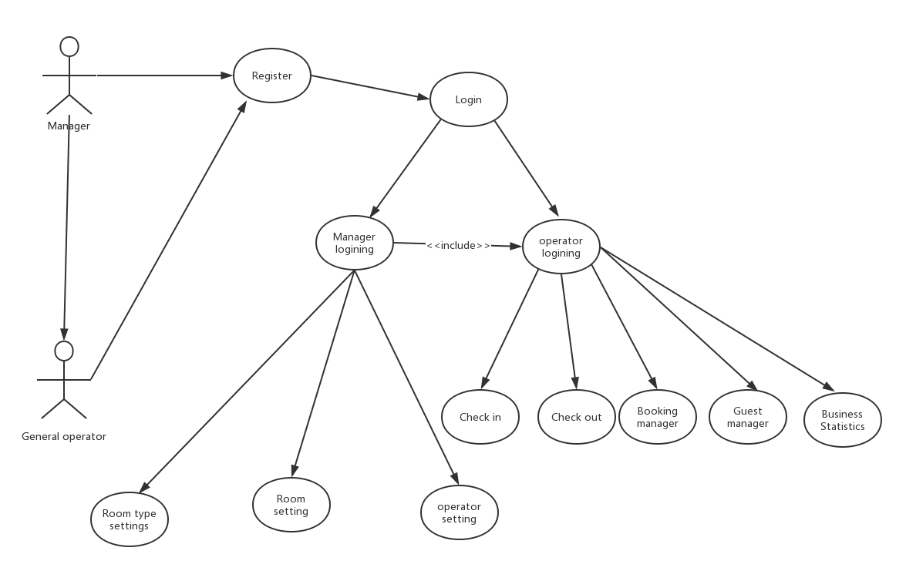
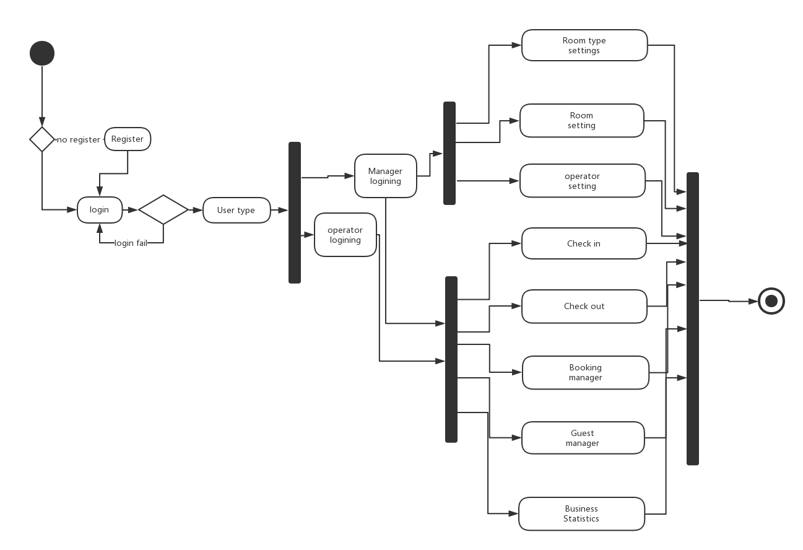
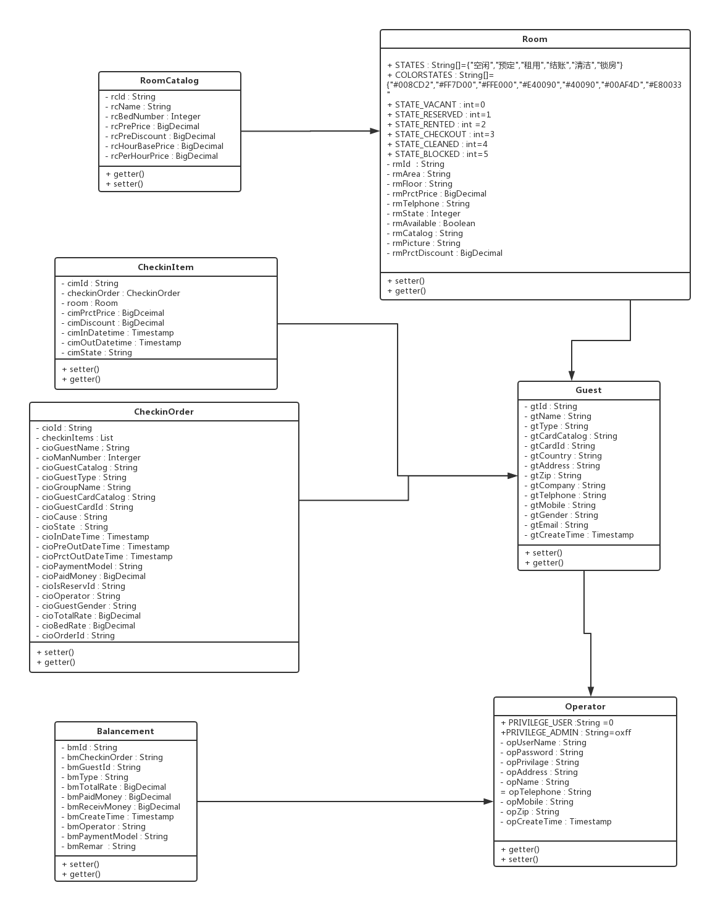
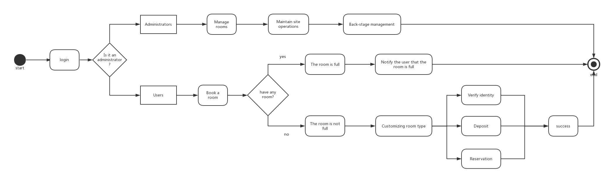
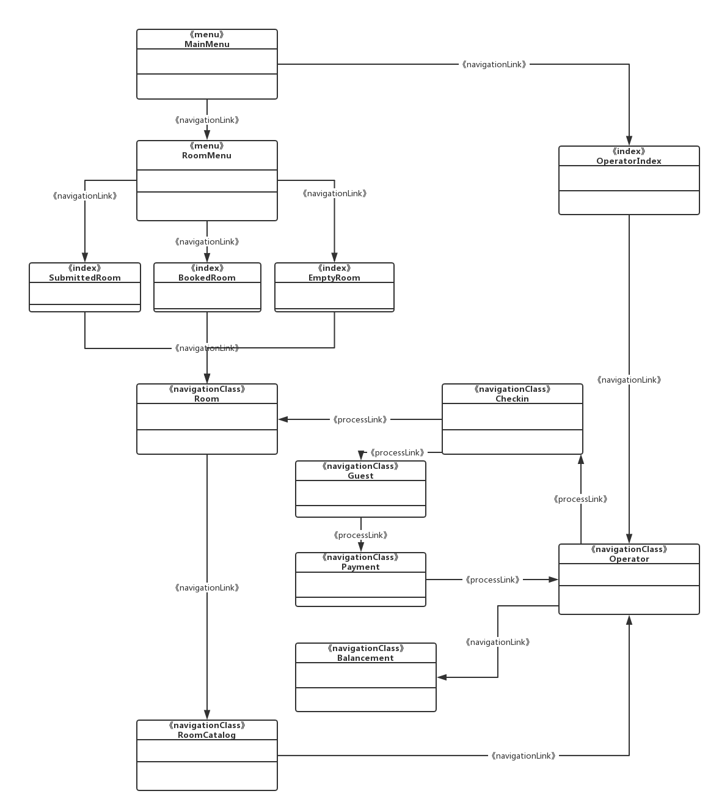
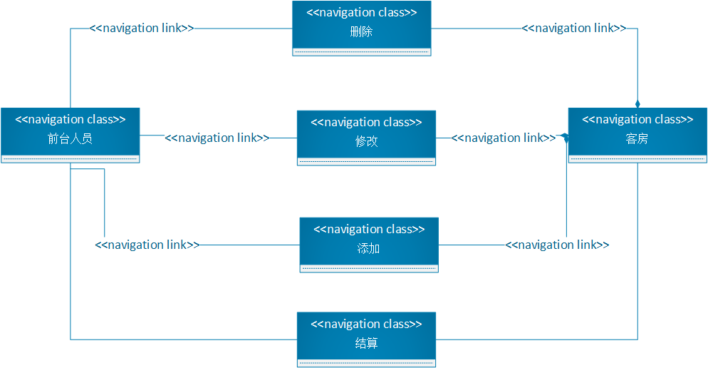
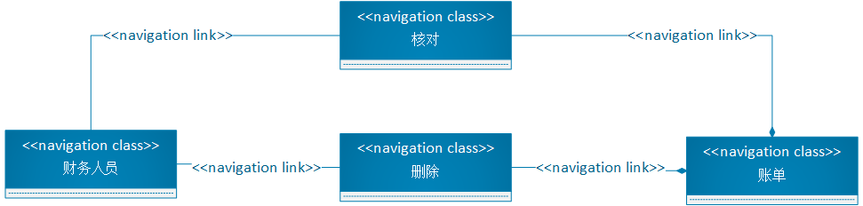
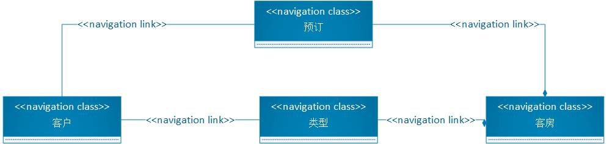
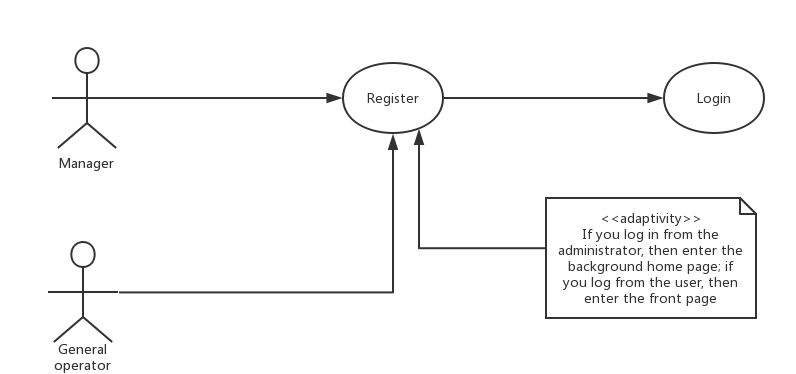
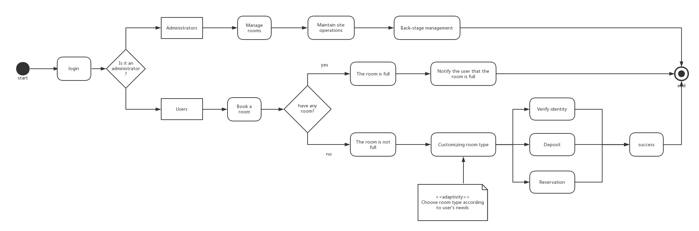

**Web应用建模**

分工：

功能需求：静态建模：魏哲 动态建模：陈奇冰

内容：静态建模： 苏靖淞 动态建模：彭硕

超文本：静态建模：张振宇 动态建模：林杜

适应性：静态建模：肖杰 动态建模：李帅

**1 功能需求**

**1.1 静态建模**

**1.2 动态建模**

**2 内容**

**2.1 静态建模**

**2.2 动态建模**

**3. 超文本**

**3.1 静态建模**

静态超文本模型

静态超文本建模主要强调超文本的结构，超文本模型模型同朝被当作内容模型的一种特定视图因此成为导航视图。

WebML:超文本模型

-   描述Web应用中的超文本

-   每个不同的超文本定义一种Web应用视图

组成模型（Composition Model）

– 组成超文本的页面

– 内容单元：数据、数据集（multi-data）、索引、过滤 器、滚动和链接

-   导航模型（Navigation Model）

– Web页面间的链接关系拓扑模式

– 表示Web页面和内容单元如何链接而形成超文本结构

– 上下文无关链接HYPERLINK/上下文相关链接INFOLINK

**3.2 动态建模**

**4. 适应性**

**4.1 静态建模**

根据系统的使用范围以及其使用的上下文特性，提供给用户合适的展示。

针对系统的直接使用者，即前台接待人员。每次客户前来消费，无论是订房或者订餐，客户都不会直接使用系统，直接使用系统的是前台接待人员。前台接待人员可以添加客房、修改客房信息、增添消费信息和根据客人消费情况进行结算。

针对系统的使用者，即财务人员，他们的主要工作就是根据客户消费记录，以及收银记录与实际的收银进行核对，以及删除过期的消费记录

针对客户来讲就是简单的预订客房功能

**4.2 动态建模**

用户进行登录时，当选择普通用户登录时，信息验证成功后进入前台首页进行相关操作；当选择管理员登录时，信息验证成功后进入后台首页进行相关操作。

当选择客房时，根据用户的需求和兴趣进行选择。
