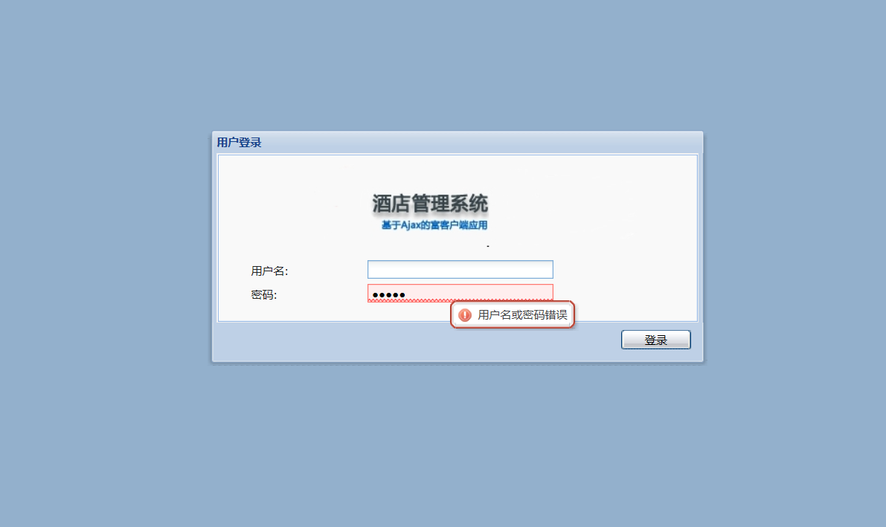
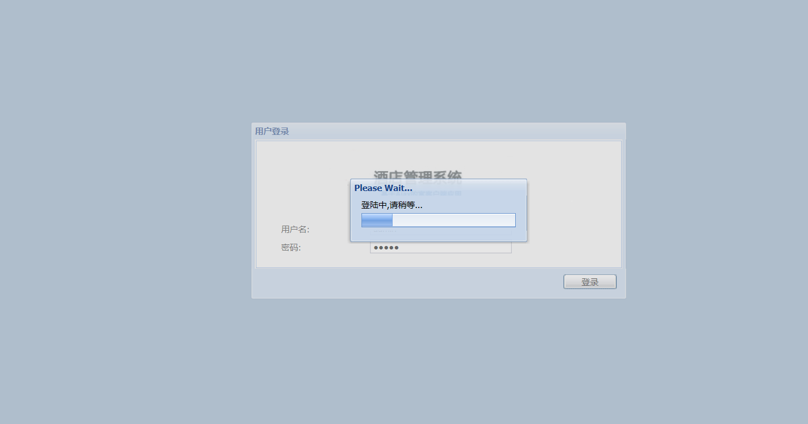
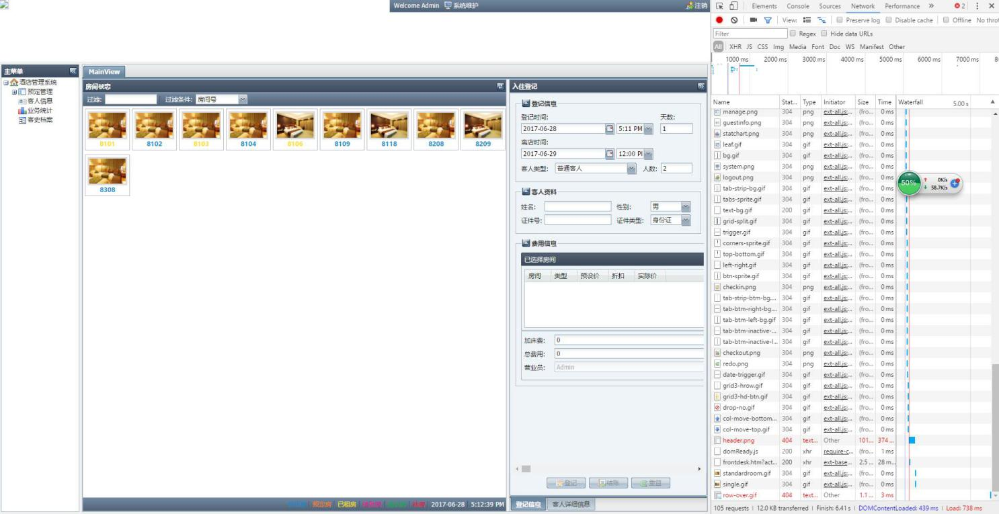
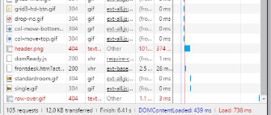
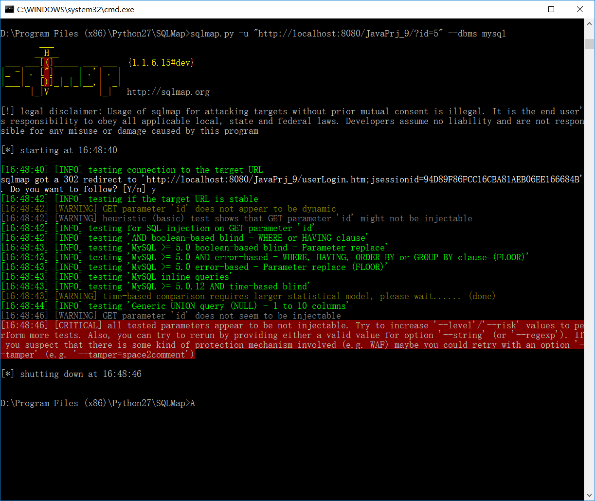
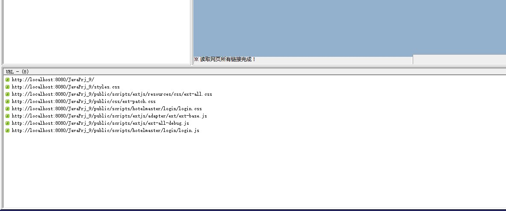
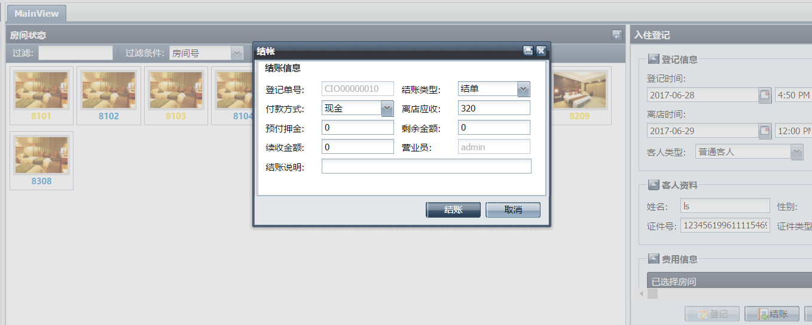
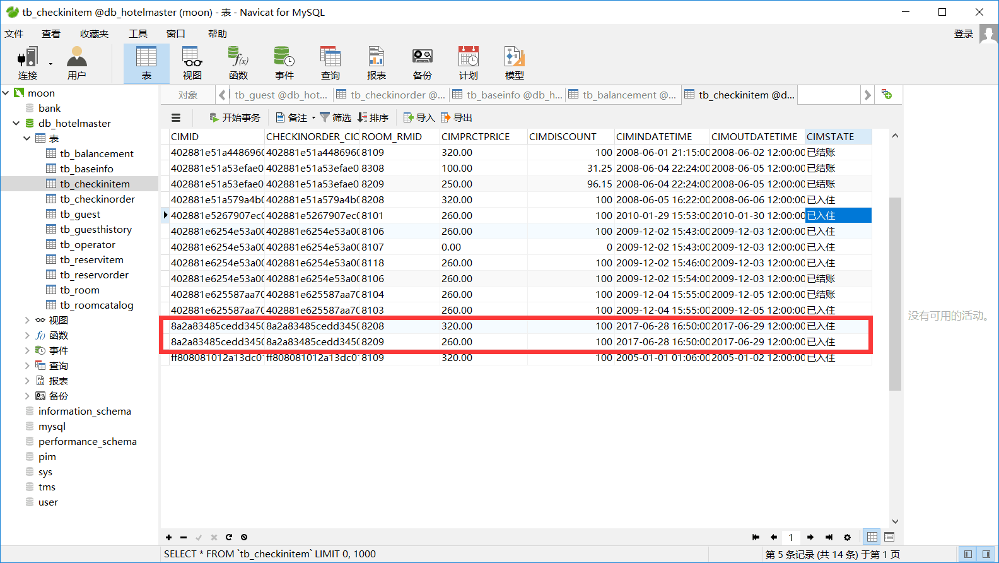

**Web应用测试报告**  

分工  

测试人员：林杜  李帅  

测试报告：功能性测试&性能测试：魏哲     安全性测试：陈奇冰     可用性测试：彭硕  

报告修改及审核： 苏靖淞

**一、功能性测试**

用例名称:验证输入错误的账号密码后是否能够正确提示

测试项：用户账号和密码

环境要求:WINDOWS Xp 以及更高级的Windows环境

参考文档:软件规格说明书SpecL001.doc

优先级:高

步骤:

1.  打开浏览器

2.  输入空的账号信息“ ”

3.  输入任意的4位密码xxxx

4.  点击登录按钮

期望结果:

登陆失败，提示用户名和密码错误。

测试结果:

该功能使用正常

**二、性能测试**

用例名称:测试用户登录时的相应时间

测试项:用户从点击登录到登陆成功的响应时间

环境要求:WINDOWS Xp 以及更高级的Windows环境

参考文档:软件规格说明书SpecL001.doc

优先级:低

步骤:

1.  打开浏览器

2.  输入账号admin

3.  输入密码admin

4.  点击登录按钮

期望结果:

用户在5S之内可以进入使用界面

测试结果:

)

所以登陆时间为730MS

**三、安全性测试**

用例名称：通过数据库注入操作验证系统的安全性

测试项：运用WebRobot和SQLMap工具对系统的数据库寻找注入点

环境要求：Windows XP以及更高级的Windows系统

参考文档：软件规格说明书SpecL001.doc

优先级：高

步骤：

1.  打开SQLMap

2.  输入sqlmap.py –u “URL?id=5”—dbms mysql

3.  直接回车测试结果，如图一所示。

4.  打开WebRObot

5.  点击抓取链接按钮，然后等待抓取结果

期望结果：

无论是SQLMap或者WebRobot的注入数据库结果，都无法找到合适的注入点。如下面两图所示。说明目前系统安全性良好。

测试结果：

SQLMap测试结果：

WebRobot测试结果：

**四.可用性测试**

用例名称: 结账功能出现故障系统仍能正常运行

测试项：结账

环境要求:WINDOWS Xp 以及更高级的Windows环境

参考文档:软件规格说明书SpecL001.doc

优先级:高

步骤:

1.  进入操作界面

2.  进入结账界面

3.  选择一位用户点击结账

4.  偶尔会出现结账失败功能

5.  查询数据库，查看数据是否丢失

期望结果:

结账失败，数据库数据未丢失。

测试结果:

此界面显示点击结账按钮无响应

查询数据库：

可以发现用户的数据并未丢失，测试成功。
