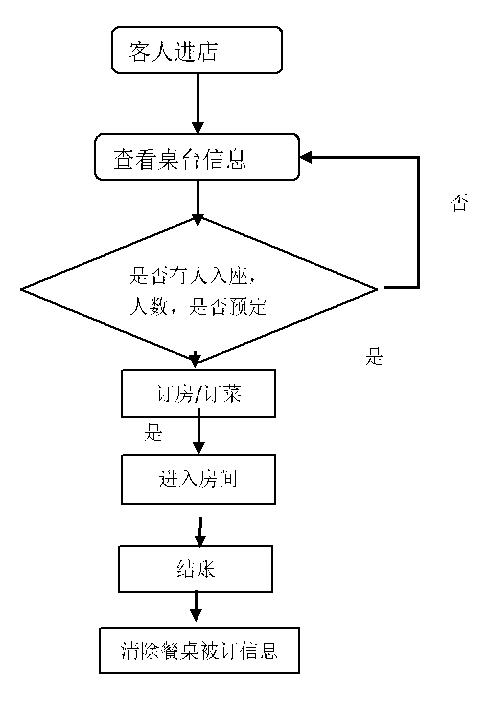

# **酒店管理系统**

**一. 项目名称**

酒店管理系统

**二. 项目介绍**

&emsp;&emsp;本项目在基于b/s架构的基础上设计了一套酒店管理系统旨在协助酒店处理酒店管理事务，项目集成了多种功能，如传统酒店管理需要的：顾客查询，登记，入住，费用结算等等。该项目前期进行了深入的市场调研，分析了现在酒店部门的职责分工和需求，并对数据流进行了详细解读，以系统分析作为依据为酒店设计了管理系统并制定了实现方案。该方案采用Java
Web技术同时利用了SQL
Server数据库，以Eclipse作为平台，以B/S作为基础，开发了具有多层架构的管理系统。酒店管理系统主要分为前台和后台两个部分，其中前台包括五个模块供所有工作人员使用：入住登记，结账，预定，客户信息管理，业务统计。实现了酒店前台人员的常用管理功能。其中后台管理系统包括客房类型，客房设置，操作员设置模块。实现了客房的详细管理和操作人员的操作管理。在总体上已经是实现了酒店管理的基本功能。利用该系统，酒店人员可以在前台实现办公自动化，同时系统提供后台数据分析，可以为酒店领导决策层提供相应经营参考，会员管理功能的实现会大大提高酒店服务水平，可以为酒店提高竞争力。

**三. 项目背景介绍**

&emsp;&emsp;随着旅游业娱乐产业的不断发展，其周边相关行业如：酒店，餐饮，娱乐场所不断增加，酒店行业规模也在不断扩大。但是新阶段的酒店面临一些问题：酒店组织庞大，服务项目过多，信息量庞大。传统的酒店管理模式已经不能满足酒店现在的服务需求。传统的酒店管理模式往往会消耗大量的人力和物力来处理顾客查询，顾客登记等业务，而错误的差查询，繁琐的登记和结账手续，酒店费用结算，空余客房不能及时提供住宿得不到利用等等问题可能会导致顾客的频繁投诉，从而影响酒店的销售额，然而这些问题都可以通过构建计算机系统来解决。我们就是根据此需求实现了酒店的信息化管理，从而提高了酒店运行效率，提供更好的管理水平和服务水平，同时降低了酒店的管理成本，加速资金周转，塑造了现代化酒店的形象。

**四. 组成结构建议**

&emsp;&emsp;由于使用了先进的数据管理技术，酒店管理系统对提高酒店的管理能力将会起到比较重大的作用。整个系统的基本设计目标是实现系统界面友好美观、简单易用、功能全面并有较高的安全性。本系统需要实现酒店常用的房间预订、入住记录查询、房间管理等功能，并帮助酒店建立客户数据库和入住记录数据库，能够方便的进行查询，并在系统的易用性和安全性两方面进行相应的完善。该系统有以下特点：

<strong>功能强大</strong>：该软件以中小型酒店为应用对象，结合中小型酒店客房当前和未来发展的管理需求提供实用先进的客房管理模式，提高酒店客房管理的效益。 

用户界面操作简洁：系统的每个功能充分考虑到使用人员计算机知识较少的特点，软件系统由各种具体的<strong>功能模块组成</strong>，全部使用业务人员最熟悉的业务流程、提示用语和操作方式，即使不熟悉此软件的人也能熟练使用本软件完成业务处理。 

<strong>系统性能稳定</strong>：严格按照规范的软件工程管理，充分利用面向对象技术，采用sql为后台数据库。从技术上和应用广泛性上保证了系统的稳定性、广泛性和先进性。

**五. 执行概要**

&emsp;&emsp;我们的项目是一个酒店管理系统，尽管是作为课程作业我们还是希望可以力求真实以达到锻炼的目的，因此在执行上我们也尽可能模拟现实世界中的真实情况。这个项目是为了解决酒店管理的实际需求，现如今为了解决人们的旅游需求，连锁酒店可以说是遍地开花，酒店管理系统对于酒店可以说是刚需，因此也就随着酒店业的繁荣成了一块大蛋糕，我们首先要考虑到如何争取到酒店的青睐将项目交给我们团队去完成，第一要务显然是成本上的吸引力，我们应该严格把控成本使得我们在竞争对手中脱颖而出，除去不可避免的开发成本，节约成本的途径在于开发过程中的取舍，我们要做的酒店管理系统，使用者是酒店的工作人员，使用这个系统是工作需求而不是个人兴趣，因此在用户界面设计上，我们追求的是易学易用，清晰明了，以达到更高的工作效率，美观则是无关紧要。

&emsp;&emsp;至于核心设计，我们所追求的则是稳定性，我们知道，普通的连锁酒店前台也就两台电脑就足以应付前来办理入住以及退房的需求，这是因为酒店的工作时间较其他单位要长得多，客户可以在下午半天的任意时间前来办理入住，也可以在上午半天的任意时间办理退房，同一时间并不会有太多客户前来办理手续，可以说系统的负载是相当小的，我们所关注的应该是住房信息实时准确，避免已入住的客房重复被开给新的客户，避免空的客房没有被列入可以入住的房间列表，以及收入支出清晰明了，金额上不能有差错，更不能宕机，因为酒店全天候24小时都不能休息才能应对客户的需求。以上就是我们完成这一项目的策略。

**六. 需求分析**

&emsp;&emsp;一套酒店管理系统是包括前台的业务领域，与后台的管理。我们对该系统的需求分析主要在于前台的业务领域。

在后台管理方面，主要是分为3个子模块：

>   1、客房类型模块。因为客房会有不同的档次设置。

>   2、第二次是客房设置模块。设置每个房间的状态，当有预约时候就要进行相应的增删查改操作。

>   3、操作员设置模块。是属于员工信息管理模块。需要对员工进行增删查改等操作。

而在系统的前台则有五个模块：

1.  入住登记模块：该模块用来记录客户入住登录的信息。

2.  结帐模块：进行客户信息注销操作，同时保有一份结账记录副本。

3.  客户管理模块：对于已登记完成的客户信息进行管理。

4.  业务统计模块：这个模块是对酒店的客房入住率、成本收益等进行分析并展示的模块。可以是管理层很快捷的就清楚酒店运营现状。

**七．项目描述**

1.概述

&emsp;&emsp;酒店管理系统是针对酒店一系列服务进行操作规范以及管理的系统，一般包含客户信息管理、房间信息管理、酒店商品管理和帐务处理等模块。优秀的酒店管理软件能显著地提高酒店的服务水平和工作效率，规范酒店的业务流程，帮助酒店管理者及时、全面地了解经营信息，做出更加准确的决策，从而有效地提高酒店的经营效益。

2.流程图

3.功能概述

客户信息管理

&emsp;&emsp;客户信息管理模块主要有客户信息，以及客户在酒店进行消费的信息，客户在进行登记后，客户的点餐记录以及住房记录会同步录入到数据库中。每当客户来进行消费时，首先会查询客户是否有过消费记录的信息，如果有消费记录的信息，如果有那么直接在原账户上进行修改，并且视消费情况给予一定的优惠。如果没有消费记录将会重新创建账户。

房间信息管理

&emsp;&emsp;酒店客房标准子模块由标准信息添加和标准信息修改两个程序组成，标准信息直接关联到房间的信息，所有的客房的标准必须是在标准表中存在的标准，另外，在许多查询的地方也用到了标准表中的信息。因此，修改标准表中的信息时，会有许多与其相关的信息就会一起修改，所以在处理房间标准信息时必须谨慎，建议只有在酒店停业整顿的时候才去修改标准信息。

酒店商品管理

&emsp;&emsp;商品管理模块由客人消费商品信息添加，商品消费信息修改，商品消费信息查询三个程序组成。商品消费信息直接与结算信息相关联，每次一添加或修改商品消费信息，结算信息也会跟着修改，所以在处理商品消费信息时一定要谨慎。

帐务处理

&emsp;&emsp;账务处理主要由客人结帐程序、结帐信息查询/统计程序组成。客人结帐程序是全自动化的，只要输入客人的姓名与房间编号，就能自动将顾客在本店所有的消费信息以清单的形式表示出来，并进行打印。结帐信息查询/统计程序，能够实现对顾客消费的查询，并能统计在某一段时间内，酒店的收入情况，顾客入住的次数等。

**八．预算**

一.工作场所

工作地点方面基于已有工作场所（宿舍，实验室，图书馆）开发，无费用。

网络方面使用校园翼讯，240RMB/8个月，团队共8人，则共计240\*8=1920 RMB

总计：1920 RMB

二.硬件费用

1.pc方面使用开发人员自己的PC机，无费用。

2.服务器购买阿里云服务器企业版通用型，每月451元，预先购买1年份即451\*12=5412 RMB

总计：5412 RMB

一.软件费用

1.运行平台为Windows10，正版Windows10专业版价格为1799，所以1799\*8=14392 RMB

2.开发环境为MY Eclipse6.5，免费。

3.数据库使用Oracle 11g企业版，1USER License无限使用期的价格为人民币 3500RMB

总计：17892

二.软件开发人员报酬

每人月薪5000，按开发时间1年计，总计8\*5000\*12=48000RMB

预算总计：1920+5412+17892+48000=73224RMB

**九．组织信息**

本组成员8人

组长：苏靖淞

组员：李帅、林杜、彭硕、魏哲、陈奇冰、肖杰、张振宇

组长苏靖淞负责Introduction、Gathering Background Information

魏哲负责The Budget

肖杰负责Project Description

李帅负责Introduction、Conclusion

陈奇冰负责The Statement of Need

张振宇负责Letter Proposal、Components of a Proposal

彭硕负责Organizational Information

林杜负责The Executive Summary

项目分工：

组长苏靖淞负责项目构建监督、维护和总结

魏哲、肖杰、陈奇冰负责web网站的规划与建设

李帅、林杜、彭硕、张振宇负责网站设计与美化。

**十. 项目建议**

（1）数据库设计要符合范式要求。

（2）能对客人入住资料进行添加删除修改操作。

（3）提供订单查询功能，输入订单号，能查找订单的相关信息。能对订单进行，添加删除修改操作。

（4）用户权限控制，服务员能对订单和客户资料进行修改，管理员用户修改登录密码。

**十一．项目总结**

&emsp;&emsp;本文采用B/S三层结构，开发了一个基于Web和客户端的酒店管理系统。通过对酒店业务的需求分析，确定了系统开发目标，采用数据库实现数据的存储和备份，实现了系统的可靠性、并发性和安全性。最后完成了酒店管理系统的设计和开发。

**（1）系统结构分析**

&emsp;&emsp;C/S一般建立在专用的网络上，网络环境受限制，通过局域网和专用服务器提供数据交换和连接服务。B/S是建立在广域网之上，客户端只需通过浏览器就可以通过Web
Server和数据库进行数据交互。采用B/S结构可以使客户端零维护，并且在安全性、可维护性、适应性、开放性等方面比C/S结构均有很大的优势。

**（2）系统性能**

&emsp;&emsp;本文开发的酒店管理系统，从功能模块划分为公共模块、系统管理员模块、酒店管理员模块、客户端模块。公共模块对所有用户开放，其他模块针对登陆者的用户权限而开放。系统操作界面友好清晰、操作简单、易于扩充。用户只需按照提示操作，就可以完成酒店业务的查询、管理、预订和评估等功能。

**（3）体会**

&emsp;&emsp;此项目建议书旨在对基于B/S模式的酒店管理系统项目的开发建议，本文从项目简介、项目开发背景、项目组成结构、项目执行概要、项目需求说明、项目描述、项目开发预算、组织信息、项目建议以及项目总结等十个方面对酒店管理系统项目进行了详细地介绍。本次项目采用Java
Web进行开发，将会使我们学到完整的开发一个Java
Web项目所需的文档和技术支持（前端+后端），熟悉Web项目开发流程，也会增加我们的Web项目开发实战经验。同时由于是团队项目，所以能够锻炼我们团队合作的能力。
