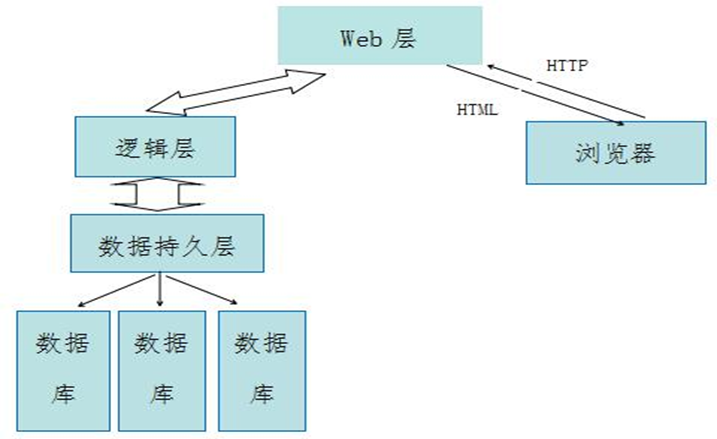

项目架构报告

项目名称：酒店管理系统

项目平台及开发环境:

• 系统开发平台：MyEclipse2015

• 数据库平台：MySQL5.7

• 数据库管理软件：Navicat for MySQL

• 运行平台：Windows 10

• Java开发包：jdk 1.8.0

• Web服务器：Tomcat 7.0

本系统采用MVC架构模式开发，具体用到技术如下：

• AJAX框架：使用ExtJS技术开发

• 显示层：使用JSP技术开发

• 数据访问层：使用DAO模式开发

• 持久层：使用Hibernate框架开发

• 管理框架：使用Spring来管理各组

(1).架构说明：本项目基于J2EE平台设计主要采用MVC架构设计模式，即（模型-视图-控制器），其主要核心思想主要是：数据和业务逻辑与控制器及页面展示分离，其中模型是核心。

模型层用来处理业务逻辑模型是指业务逻辑的处理，接受视图请求，并返回最终得结果。

视图层主要是用来展现户所需数据，是和用户进行交互的界面，采用HTML/JSp来实现。

控制器接收用户的请求，将模型与视图进行匹配，完成用户的请求。

这样做的优点主要是：

1.低耦合性

2.高重用和可适用性

3.较低的开发生命周期成本

4.快速部署

5.可维护性

7.有利于软件工程化管理

(2).同时采用了B/S架构模式：Browser/Server结构是Web兴起后的一种网络结构模式，用户不再依赖于单一的通过下载客户应用软件来访问信息。

1.  客户端即浏览器主要负责人机交互。

2.  WEB 层主要负责对客户端应用程序的集中管理，对请求做出响应。

3.  逻辑层主要负责应用逻辑中的集中管理即事务处理。

4.  数据持久层位于数据库之上隐藏数据读取和操纵中的所有数据访问代码细节完全抽象出开发小组建立应用程序时使用的数据物理细节。

5.  数据库则主要负责数据的存储等等。

6.  
