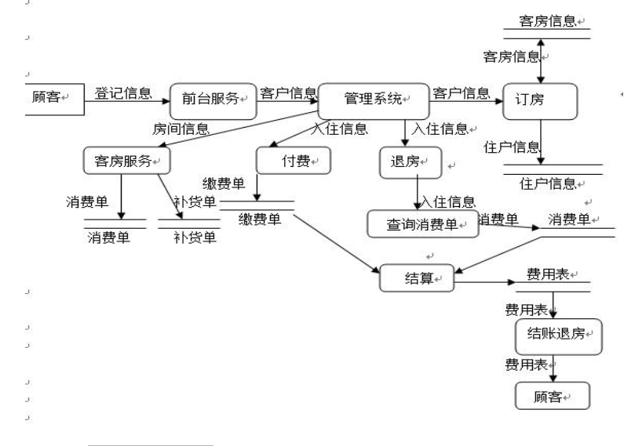

# **项目规格需求说明书**

**一．引言**

1.1编写目的

软件需求规格说明描述了“酒店管理系统”，的软件功能性需求和非功能性需求。这一文档计划由实现系统功能和测试系统功能正确的项目团队成员使用。除非在其他地方另有说明，这里指定的所有需求都具有高优先级。

1.2文档约定

标题采用2号黑体，占3行。

正文采用4号宋体，1.5倍行距。

每个需求陈述都具有优先级。

1.3预期的读者和阅读建议

该软件需求规格说明针对开发人员，项目经理，管理人员，用户及测试人员。本文分别介绍了产品的远景规划，用户功能以及运行环境，项目的功能点具体描述，及外部接口的需求。

1.4项目范围

“酒店管理系统”允许X酒店的管理人员从内部管理酒店内的订房，退房，人员流动等事项，详细项目描述参见第二章具体描述中的产品前景和功能描述。

1.5参考资料

李兆峰所著JAVA+WEB项目开发案例精粹

**二．项目描述**

2.1 产品前景

随着互联网融入生活越来越多的事情用到了软件系统，尤其是随着业务的大规模化单靠人力已经无法清晰的分析业务逻辑，处理事务。针对酒店越来越大规模，尤其是一些星级酒店，不单单是只有简单的住宿业务，还有更加复杂的业务。尤其是随着互联网进入生活，电脑办公更加彰显速度与准确率，越来越多的酒店引入了互联网办公。因此在这种背景下我们提出了此酒店系统的设计，他能够提供客户信息查询，报表查询等等一系列功能，让更多的工作人员从繁重的事务中解脱出来。尤其是随着国民经济的提高。越来越多的国民不满足于吃喝，而更多的是走出户外旅游，因此酒店住宿问题也越来越迫切，方便快捷的酒店管理系统不仅解脱了办公人员也使得消费人员更加省时省力。

2.2 产品的功能

针对当前的需求，我们设计了如下的酒店管理系统，包括一下模块：

2.2.1 前台系统

前台系统下有客房预订、收银系统等等子模块。

客房预订管理模块主要有客户信息，以及客户在酒店进行消费的信息，客户在进行登记后，客户的点餐记录以及住房记录会同步录入到数据库中。每当客户来进行消费时，首先会查询客户是否有过消费记录的信息，如果有消费记录的信息，如果有那么直接在原账户上进行修改，如果没有消费记录将会重新创建账户。

收银系统在客户进行结账时，统计客户的消费信息，进行买单，查账，转账一系列操作。查询客户是的消费记录的信息，并且视消费情况给予一定的优惠。

2.2.2 后台系统

后台系统包括客房信息模块，电话系统，具有修改客房定价、密码处理、修改特别客单、设置系统参数、内部银行、数据整理、自我诊断以及数据备份等功能。电话系统需求规定拥有自动计费功能；

2.2.3 数据库系统

数据库系统又包括报表系统以及账务报表。报表系统包括客房信息、租房信息客、房租分析表、坏房报告表。账务报表需求包括：收入报表、消费报表、顾客账务、交班报表、信用卡报表、街账报表、应收报表、催帐报表、转账报表、贷款总会、联网消费以及酒店总表。

2.3 用户类及其特征

2.3.1 顾客

顾客是进行酒店预订的游客，对于游客来讲不会直接操纵酒店管理系统，但是对于他们而言要尽可能的方便便捷，无错误。方便就是入住信息一体化，当顾客入住时直接通过一次登记信息来使用，每次增加消费记录时不必要进行再次登记，省去了很多麻烦。无错误就是要准确记录消费信息不能出现错记情况。

2.3.2 酒店管理人员

他们是系统的直接使用者，他们并没有太多的计算机专业知识，因此要尽可能减少专业性描述，给予清晰的操纵画面。增加或者修改客房信息时也应该尽可能一次修改，到处使用，而不应该要多次修改，避免了错误以及增加了便捷性。

2.4 运行环境及约束

操作系统：Windows 10

数据库： Mysql

浏览器：Internet Explorer 

开发工具 MyEclipse

开发语言 Java Html

2.6 假设和依赖

系统为24小时不间断工作系统，因为酒店的特殊性，顾客总是会在晚上来临，而且晚上顾客也可能会有需求。

**三．系统功能：**

酒店系统管理功能主要有前台和后台两大部分。其中后台提供管理员来操作管理系统,其中包括三个子模块：客房类型设置米快、客房设置模块以及操作员设置，具体功能如下：

3.1.客房模块

3.1.1描述和优先级

提供用来管理酒店的所有信息，包括新增客房、编辑已有客房、删除客房等功能。优先级为高。

3.1.2 请求响应序列

请求：点击新增客房

相应：系统向操作员提供新增客房类型按钮

请求:：操作员请求编辑已存在客房类型数据

相应：如果客房已存在。则返回编辑选项，包括编辑客房入住人数类型，客房入住时长，客房房间号等信息。如果客房不存在，则不返回相应的编辑选项。

请求：操作员请求删除已存在客房数据

相应：如果客房存在，提供删除选项，点击删除选项则完成删除操作。如果没有已存入的客房数据类型，则不返回删除操作。

请求：操作员可以请求新增操作员信息，包括以下操作：新增，编辑，删除等

响应：如果操作员信息已经存在则无需新增相同数据，可以编辑包括删除相应数据。

3.1.3功能分析：

•客房类型设置模块：该模块用来管理酒店的所有客房类型，包括新增客房类型、编辑已有客房类型、删除客房类型等功能。

•客房设置模块：该模块用来管理酒店的所有客房信息，包括新增客房、编辑已有客房、删除客房等功能。

•操作员设置模块：该模块用来管理酒店的操作员信息，包括新增操作员、编辑已有操作员信息、删除操作信息等功能。2.客户模块

3.2.1描述

系统前台供酒店所有工作人员使用，包括入住登记模块、结账模块、预定模块、客户管理模块以及业务统计5个模块。

3.2.2请求响应序列

请求：客户请求入住。

响应：相应客户请求，如果信息不存在，则前台工作人员帮助输入信息包括：登记信息、客人信息以及费用信息三部分。

请求：客户请求结账。

响应：如果之前没有结账则需要客户入住房间号就可以直接退房。

请求：客户请求修改预定客房信息

响应：客房信息不存在，可以修改，支持新增预订信息。

请求：客户请求修改入住人员信息

响应：支持新增入住人员信息，删除信息，编辑信息等。

请求：领导管理人人员请求查看业务数据

响应：支持以报表形式展示客房出租信息。

3.2.3功能信息：

•
入住登记模块：该模块用来登记客户的入住信息，其中入住信息包括登记信息、客人信息以及费用信息三部分。

•
结账模块：该模块用来处理客户的退房信息，只需要知道客户所住的房间号码，就能进行退房结账。

•
预定模块：该模块用来处理客户的预定信息，除了可以新增预定信息外，还可以对已有的预定信息进行管理。

•
客户管理模块：该模块用来管理客户的登记信息，包括新增客户信息、编译已有客户信息、删除客户信息等功能。

•
业务统计模块：该模块用来统计酒店的客房出租率，并且以图形报表的形式来显示出租率信息。

**四．外部接口需求**

4.1 用户接口

本系统采用B/S架构，所有界面采用Web风格，而且界面内容简单易懂。

在酒店管理系统的登录对用户信息（用户名和密码）进行验证并登录，点击登录验证成功后跳转到酒店管理系统的首页。

在左侧的导航树中选择“预定管理”\|“预定中心”链接，即可打开预定管理界面。

在左侧的导航树中选择“客人管理”链接，即可打开客户管理界面，编辑客户的信息。

在左侧的导航树中选择“业务统计”链接，即可打开业务统计界面。在该页面中通过柱状图的形式，显示了酒店每月的入住率。

Web页面的全部导航和条目选择，除了综合使用鼠标和键盘共同完成外，还可以只通过键盘来单独完成。

4.2 硬件接口

由于本系统为B/S架构，故主要运行在浏览器。

服务器端使用专用服务器。

4.3 软件接口

4.3.1订房系统

订房系统联系起房间管理系统和客人管理系统，将所有已入住或预订的客人

信息与房间信息绑定，以确定房间的当前状态是否可以接受预订以及当前空房数，当有订单时，从可接受预订的房间列表中选择空房间。

4.3.2房间管理系统

房间管理系统中保存当前所有房间的信息以及入住状态，当收到订房系统的订房请求时返回当前客房的入住状态，生成可入住房间列表，收到订房系统的确认信息时，将客人信息录入相应房间，并将该房间从可入住列表中删除，直至收到订房系统所发送的退房信息

4.3.3客人管理系统

客人管理系统负责记录客人的个人信息，预订信息以及消费金额，通过订房系统将客人信息发送给房间管理系统以完成登记入住，当收到订房系统发送的退房信息时返回消费金额核实收支情况，还兼具结算总收入的功能。

4.4通信接口

由于本系统是酒店内部管理使用的系统，对外仅需开放一个web端订房系统的接口，登记用户的个人信息和预订请求，仅当房间管理系统返回有效的可入住房间列表时，该请求生效并录入房间管理系统，否则向用户提示没有空房间。

**五．其他非功能性需求**

5.1性能需求

5.1.1:系统将在节假日达到高峰期，系统将能适应400个用户，平时下午和晚上将是开房的高峰期，上午和中午将是退房的高峰期。

5.1.2:用户提交了查询之后，对查询的响应时间不能超过7秒，在此事件内将要查询结果显示在屏幕上

PE-3：用户向系统提交信息后，系统将在4秒内向用户显示确认信息。

5.2安全性需求

5.2.1：所有涉及功能信息或个人身份信息的网络事务，都要进行加密操作。

5.2.2：除浏览菜单外，用户必须登录到“酒店订房系统”才能完成其他操作

5.2.3：顾客的登录受计算机系统访问控制策略的限制。

5.2.4：酒店的工作人员，只有哪些授权为管理员的，才能通过新系统创建或编辑菜单。

5.2.5：只有那些被授权可以在家访问公司内联网的用户，才可以在公司以外的地方使用“酒店订房系统”

5.2.6：系统只允许顾客浏览他们自己以前的订单，而不能浏览其他顾客的订单。

5.3软件质量属性

可用性：“酒店订房系统”将对公司内联网的用户可用，拨号用在当地时间早晨5点到晚上12点内99.9%的时间可用，当地时间晚上12点到早晨5点95%的时间可用。

健壮性：如果在订单得到确认或取消之前，用户和系统的连接中断，那么用户能通过“酒店订房系统”恢复不完整的订单。

**六．实体关系图**

6.2 实体定义

客户、客房、

| 实体名称           | 客户                                     |      |      |
|--------------------|------------------------------------------|------|------|
| 实体描述           | 记录着入住客户的个人信息                 |      |      |
| 属性名称           | 类型                                     | 精度 | 备注 |
| 姓名               | 字符                                     | 12   |      |
| 性别               | 字符                                     | 8    |      |
| 身份证             | 字符                                     | 20   |      |
| 电话               | 整型                                     | 11   |      |
| 实体名称           | 预订                                     |      |      |
| 实体描述           | 记录着入住客户的预订信息                 |      |      |
| 属性名称           | 类型                                     | 精度 |      |
| 客户姓名           |                                          |      |      |
| 房间编号           |                                          |      |      |
| 入住日期           |                                          |      |      |
| 提供服务的员工编号 |                                          |      |      |
| 实体名称           | 入住                                     |      |      |
| 实体描述           | 记录着入住客户的入住信息                 |      |      |
| 属性名称           | 类型                                     | 精度 | 备注 |
| 顾客编号           | 字符                                     | 12   |      |
| 房间编号           | 字符                                     | 8    |      |
| 入住时间           | 字符                                     | 20   |      |
| 顾客身份证         | 整型                                     | 11   |      |
| 提供服务的员工编号 |                                          |      |      |
| 实体名称           | 退房                                     |      |      |
| 实体描述           | 记录着入住客户的退房信息                 |      |      |
| 属性名称           | 类型                                     | 精度 | 备注 |
| 房间编号           | 字符                                     | 12   |      |
| 退房日期           | 字符                                     | 8    |      |
| 顾客身份证         | 字符                                     | 20   |      |
| 提供服务的员工编号 | 整型                                     | 11   |      |
| 实体名称           | 客房服务                                 |      |      |
| 实体描述           | 记录着为客户提供的各种服务的清单         |      |      |
| 属性名称           | 类型                                     | 精度 | 备注 |
| 服务名称           | 字符                                     | 10   |      |
| 服务名称           | 字符                                     | 10   |      |
| 服务编号           | 字符                                     | 20   |      |
| 提供服务员工编号   | 字符                                     | 10   |      |
| 实体名称           | 顾客消费清单                             |      |      |
| 实体描述           | 记录着客户的消费信息，作为酒店存档保存。 |      |      |
| 属性名称           | 类型                                     | 精度 | 备注 |
| 客户姓名           | 字符                                     | 12   |      |
| 入住时间           | 字符                                     | 8    |      |
| 身份证             | 字符                                     | 20   |      |
| 电话               | 整型                                     | 11   |      |
| 退房时间           | 字符                                     | 8    |      |
| 消费总额           | 整型                                     | 30   |      |

注释：这里偏重于前台业务的服务，所以省略了酒店自身员工的模块。此外，对于酒店日常经营的业务统计模块由于数据量过大，结构过于繁琐，所以也暂时没写。

**七．业务规则与业务算法**

7.1.业务规则

7.1.1对功能的规定

该系统的具有以下功能：

（1）客房预订 

（2）前台收银 

（3）财务管理 

（4）客房管理 

（5）报表管理 

（6）系统维护 

（7）总经理管理

7.1.2对性能的规定  

7.1.2.1精度  

1.该系统的所有输入输出的数据精确到小数点后两位。货币金额数据类型均按实数保存，在显示处理时保留小数点后4位。 

2.文本安装基本文字规范录入。  

7.1.2.2时间特性要求

作为企业的一个重要管理部门要求及时性。进行和查询时以秒为单位，以达到实时性；而进行增加，删除和修改等操作时，可以根据数据的多少分别以秒和分为单位，原则是操作人员不因时间而影响效率。 

1）响应时间：统计、查询数据数据的相应时间控制在30秒内一卡通读卡时间控制在0.5秒之内，写卡时间控制在0.8秒之内 

2）更新处理时间：局域网数据库在网络无故障的情况下，插入一条数据和更新一条数据的数据库操作响应时间控制在0.5秒/条之内 

3）数据的转换和传送时间：在拨号网络连接通后，交换数据以数据单元形式进行，所有数据交换过程控制在20分钟内 

4）运行时间：程序启动和初始化时间控制在3秒之内

7.1.3数据管理能力要求  

 考虑到酒店的业务特点和每天的实际业务量的情况：要求能存储海量数据的能力，并且能够对大量数据处理有强大的功能和快的响应时间。鉴于开发条件有限，Microsoft SQL Server2008数据库设计约束，编码人员技术不成熟、编程语言限制为Java、时间仓促，在完善软件功能上还有些欠缺。 

 系统内数据保存具有持久不丢失性，数据的安全保证要能防止病毒和网络上非法用户如黑客的获取。这些可以通过对Web服务器的维护管理和各种杀毒与网络安全系统来提供保证，不属于本系统数据安全性要求范围内。

7.1.4设备  

 为了达到系统要求，必须依靠高起点的硬件环境和软件开发工具来保证系统的稳定和正常运行。酒店电脑系统要求24小时连续运行，数据量大，可靠性要求高，因此整个电脑系统供电采用专线方式，加配lips（不间断供电系统），并合理接地，以便保障整套系统的正常运行。 

 硬件环境： 

 处理器：Intel双核心处理器：支持多线程，二级缓存为2MB或4MB，主频133MHZ或266MHZ 

 内存：2GB 支持DDR2   硬盘：不少于80GB 

 电源：有内置电源以及外置电源，外置电源能够提供突然断电提供时间保存数据作用。

2.算法功能说明

(1） 记录日志部分

本系统应该能够记录系统运行时所发生的所有错误，包括本机错误和网络错误。这些错误记录便于查找错误的原因。 

（2）验证权限部分

本系统的所有功能都应该进行功能权限、部门权限的判断和控制。 

（3）控制必录入项部分

本系统能够对必须录入的项目进行控制，使用户能够确保信息录入的完整。

（4）方便操作 

尽量从用户角度出发，以方便使用本产品。如：录入商品信息时，敲入回车键光标的自动跳转、输入法的自动转换，信息检索时输入汉语简拼快速检索到结果等。 

（5）用户可自定义 

为了满足业务的不断变化，一些重要的参数应该可以灵活设置。 

（6）易学易用。智能分析用户行为，并提示用户关联操作。 
